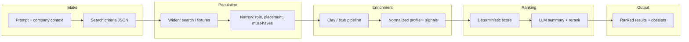

# Talent Compass

**One line:** Turn a plain-language hiring brief into a ranked shortlist of engineers—each with a dossier that explains *why* they fit, grounded in public signals you can click through.

---

## The story (what actually happens)

You are not searching a spreadsheet. You are describing a *placement*: the role, the stack, the domain, sometimes the city or country—and the softer things only a human would say (“must have shipped realtime infra,” “nice if they write,” “we care about OSS more than FAANG pedigree”).

### 1. From messy intent to a search contract

The product listens to **company context** (who you are, what you build) and the **user prompt** (who you need). An intake model turns that into structured **search criteria**: role title, stack, domain, seniority hints, must-haves and nice-to-haves, signals you want to see in the wild (repos, talks, blogs, community), and **sharpening questions**—the kind of tradeoffs recruiters argue about in a intake call.

That JSON is the contract for everything downstream. If the model hiccups, a deterministic fallback still extracts keywords from the prompt so the flow never dead-ends.

### 2. From a population to *your* population

In a live pipeline, you start from a **fetched population** (for example, people search keyed off titles, locations, and keywords). That is the wide net.

Then the world narrows: **placement** (where they can work), **role shape** (level and kind of engineer), and **prompt-specific requirements** (the must-haves and evidence signals from step 1). The exact filtering mix depends on which integration is active—Apollo-style search parameters, Clay-enriched fields, or both.

### 3. Clay: find the person behind the title

Structured search returns names, employers, sometimes a LinkedIn URL. **Clay** (or an equivalent enrichment layer) is responsible for going wider: **GitHub**, **LinkedIn**, other social and professional surfaces, and normalized fields such as skills, accomplishment summaries, and signals like **movability** (how plausible a move might be, with a short reason).

When Clay finishes a row, it posts back to the app; the backend stores the cleaned payload and marks the candidate enriched. Nothing magic: it is **data in, normalized record out**, ready for scoring and copy.

### 4. AI: summarize, do not invent

Candidates carry **evidence items**—repos, posts, talks, employment-shaped snippets, network hints—with strength and recency. A **ranking** pass combines:

- A **deterministic** score aligned to your criteria (role fit, stack, domain, evidence strength, recency, signal confidence, reachability bonus).
- An **LLM ranking** that must stay grounded in the provided payloads: **why they match**, **top strengths**, **risks or gaps**, and **explicit references** to evidence IDs—so the UI can show a verifiable trail, not a hallucinated bio.

The output is **placement-aware**: ranked lists, per-candidate narratives, and **factor breakdowns** that read like a senior recruiter’s notes, but tied to the same JSON your filters use.

### 5. What the hiring manager sees

The client walks a short path: **context** → **discovery** (while ranking runs) → **results** (ranked table) → **dossier** (deep dive: evidence, network, intro paths where modeled). Each row answers: *why this person, for this search, right now?*

---

## How this maps to the repo


| Stage                                              | Where it lives                                                                                                           |
| -------------------------------------------------- | ------------------------------------------------------------------------------------------------------------------------ |
| Intake (prompt → criteria JSON, thread id)         | `convex/intake.ts`, `convex/agents.ts` (`searchIntakeAgent`), `convex/lib/ranking.ts` (`searchCriteriaSchema`, fallback) |
| “Clay queue” + import + ranking (demo path)        | `convex/clay.ts` (`enqueueStub`), `convex/rankingActions.ts` (seed stubs, `runRanking`)                                  |
| Deterministic scores + factor model                | `convex/lib/ranking.ts`                                                                                                  |
| LLM ranking (summaries, rerank, evidence refs)     | `convex/rankingActions.ts`, `convex/agents.ts` (`rankingAgent`)                                                          |
| HTTP API for headless runs                         | `convex/http.ts` → `POST /api/rank`                                                                                      |
| Live Apollo search + Clay webhook (parallel track) | `convex/searchAction.ts`, `convex/http.ts` → `POST /clay-webhook`, `convex/candidates.ts` (`updateFromClay`)             |
| UI flow                                            | `src/App.tsx`, `src/components/talent-compass/`*                                                                         |





**Demo vs production:** The **Talent Compass** UI and `POST /api/rank` use the **stub pipeline**: after intake, `enqueueStub` imports curated candidates from `convex/lib/candidateStubs.ts` and runs ranking—so you can demo the full story without Apollo or Clay keys. The `**search` action** in `convex/searchAction.ts` is the **live** path: Claude → Apollo → Convex rows → Clay webhook when `CLAY_WEBHOOK_URL` is set.

---

## Quickstart

Requirements: [Bun](https://bun.sh/) (see `package.json` `packageManager`), a [Convex](https://convex.dev) project.

```bash
bun install
bun run dev
```

This runs Convex and Vite together. Open the Vite URL, add context, describe the role, and advance through discovery to results and dossiers.

**Convex environment variables** (set in the Convex dashboard for your deployment):

- `**ANTHROPIC_API_KEY`** — required for intake and ranking agents (`@ai-sdk/anthropic` via `@convex-dev/agent`).
- `**APOLLO_API_KEY**` — only if you use the Apollo `search` action.
- `**CLAY_WEBHOOK_URL**` — only for live Clay pushes from `searchAction`; optional (enrichment is skipped if unset).

---

## Headless API

`POST /api/rank` (Convex HTTP action; full URL is your deployment’s HTTP domain + path) accepts JSON:

```json
{
  "prompt": "Staff backend engineer, EU timezone, Postgres and event-driven systems…",
  "companyContext": "We build …"
}
```

It returns `requestId`, parsed `criteria`, ranking status, `results`, and `dossiers` for each scored candidate. See `convex/http.ts` for the exact payload shape.

---

## Tests

```bash
bun run test
```

---

## One-sentence pitch

We filter a real population for your placement, enrich it until each person has a grounded public footprint, then use AI to **summarize and rank** with evidence you can audit—so the shortlist is both **fast** and **defensible**.