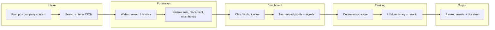

# Talent Compass

**Find the most exceptional engineers in the world — and know exactly why each one fits.**

Most hiring tools help you search a database. Talent Compass helps you describe a placement: the role, the stack, the domain, the culture, and the harder-to-articulate things — *"must have shipped realtime infra at scale," "we care about OSS contributions more than FAANG pedigree," "they should write."*

The difference is not speed. It's explainability. Every candidate in your shortlist arrives with a verifiable evidence trail — repos, blog posts, talks, community signals — so you're never asked to trust a black box. You can click through everything.

---

## Why this exists

The best engineers are rarely the most visible ones. They're not necessarily posting on LinkedIn or responding to cold recruiter messages. They're building things, writing about hard problems, contributing to communities that matter, and leaving a trail of public work that, if you know how to read it, tells you more than any résumé ever could.

The gap isn't data — GitHub, blogs, and community signals are all public. The gap is **interpretation**: connecting what a candidate has actually built to what your specific company needs, and then surfacing a clear, auditable reason why this person, for this search, right now.

That's what Talent Compass does.

---

## The story (what actually happens)

You are not filling out a filter form. You are describing a placement — and the system asks the sharpening questions a senior recruiter would ask in an intake call: *Do you care more about distributed systems depth or frontend performance? Does OSS contribution matter, or is private-sector experience fine?*

### 1. From messy intent to a search contract

The product listens to company context (who you are, what you build) and the user prompt (who you need). An intake model turns that into structured search criteria: role title, stack, domain, seniority hints, must-haves and nice-to-haves, and the signals you want to see in the wild — repos, talks, blogs, community memberships.

That JSON is the contract for everything downstream. If the model hiccups, a deterministic fallback still extracts keywords from the prompt so the flow never dead-ends.

### 2. From a population to *your* population

Starting from a wide net — people keyed off titles, locations, and keywords — the world narrows: placement (where they can work), role shape (level and kind of engineer), and the specific must-haves from step 1. The exact filtering mix adapts to whichever integration is active: Apollo-style search parameters, Clay-enriched fields, or both.

### 3. Clay: find the person behind the title

Structured search returns names, employers, sometimes a LinkedIn URL. Clay (or an equivalent enrichment layer) goes wider: GitHub, LinkedIn, other professional surfaces, plus normalized fields like skills, accomplishment summaries, and a movability signal — how plausible a move might be, with a short reason.

### 4. AI: summarize, do not invent

Candidates carry evidence items — repos, posts, talks, employment-shaped snippets — with strength and recency. The ranking pass combines:

- **A deterministic score** aligned to your criteria: role fit, stack match, domain relevance, evidence strength, recency, signal confidence, and a reachability bonus.
- **An LLM ranking** that must stay grounded in the provided payloads. Why they match. Top strengths. Risks or gaps. Explicit references to evidence IDs — so the UI shows a verifiable trail, not a hallucinated bio.

### 5. What the hiring manager sees

A short path: **context → discovery → results → dossier.** Each row answers: *why this person, for this search, right now?* Click into any candidate and see the specific repos that matched, blog excerpts that show domain depth, community signals, and — where modeled — a network proximity path to a warm intro.

---

## How this maps to the repo

| Stage | Where it lives |
| --- | --- |
| Intake (prompt → criteria JSON) | `convex/intake.ts`, `convex/agents.ts` (`searchIntakeAgent`), `convex/lib/ranking.ts` |
| "Clay queue" + import + ranking (demo path) | `convex/clay.ts` (`enqueueStub`), `convex/rankingActions.ts` |
| Deterministic scores + factor model | `convex/lib/ranking.ts` |
| LLM ranking (summaries, rerank, evidence refs) | `convex/rankingActions.ts`, `convex/agents.ts` (`rankingAgent`) |
| HTTP API for headless runs | `convex/http.ts` → `POST /api/rank` |
| Live Apollo search + Clay webhook | `convex/searchAction.ts`, `convex/http.ts` → `POST /clay-webhook`, `convex/candidates.ts` (`updateFromClay`) |
| UI flow | `src/App.tsx`, `src/components/talent-compass/*` |



**Demo vs. production:** The UI and `POST /api/rank` use the stub pipeline — after intake, `enqueueStub` imports curated candidates from `convex/lib/candidateStubs.ts` and runs ranking, so you can demo the full story without Apollo or Clay keys. The live path lives in `convex/searchAction.ts`: Claude → Apollo → Convex rows → Clay webhook (when `CLAY_WEBHOOK_URL` is set).

---

## Quickstart

**Requirements:** [Bun](https://bun.sh/) (see `package.json` `packageManager`), a [Convex](https://convex.dev) project.

```bash
bun install
bun run dev
```

This runs Convex and Vite together. Open the Vite URL, add context, describe the role, and advance through discovery to results and dossiers.

**Convex environment variables** (set in the Convex dashboard):

| Variable | Required | Purpose |
| --- | --- | --- |
| `ANTHROPIC_API_KEY` | Yes | Intake and ranking agents |
| `APOLLO_API_KEY` | No | Live Apollo search action |
| `CLAY_WEBHOOK_URL` | No | Live Clay enrichment pushes |

---

## Headless API

`POST /api/rank` accepts JSON:

```json
{
  "prompt": "Staff backend engineer, EU timezone, Postgres and event-driven systems…",
  "companyContext": "We build …"
}
```

Returns `requestId`, parsed criteria, ranking status, results, and dossiers for each scored candidate. See `convex/http.ts` for the exact payload shape.

---

## Tests

```bash
bun run test
```

---

## One-sentence pitch

We filter a real population for your placement, enrich it until each candidate has a grounded public footprint, then use AI to summarize and rank with evidence you can audit — so the shortlist is both fast and defensible.
